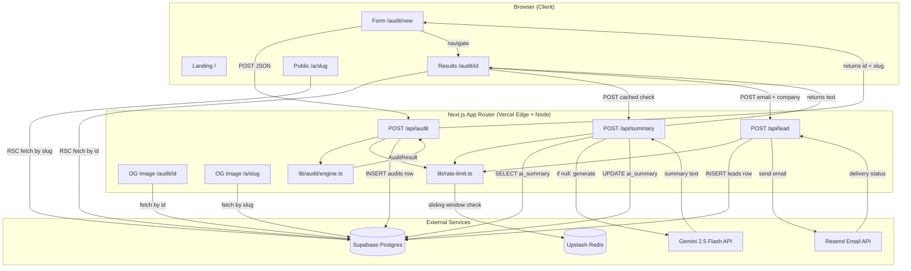

# ARCHITECTURE.md

System design, data flow, and the 10,000-audits/day question.

---

## System diagram



---

## Key architectural decisions

### Pure-function audit engine

`lib/audit/engine.ts` is a pure function — no I/O, no side effects, no API calls. It takes an `AuditInput` and returns an `AuditResult`. This makes it:

- **Testable in isolation.** 24 tests run in <1s with no network, no DB, no mocks needed.
- **Runnable client-side.** The `/audit/preview` fallback path (sessionStorage → no backend) runs the same engine in the browser with zero changes.
- **Auditable.** Every finding's `math` field is assembled from typed constants in `lib/pricing/data.ts`. A human can check any recommendation by reading two lines of source.

The tradeoff: pricing data is baked into the build. When Cursor changes its pricing, we need to push a code change. This is intentional — stale pricing displayed with false confidence is worse than stale pricing that requires a human to notice and update.

### RSC by default, client components only where needed

Every route (`/`, `/audit/new`, `/audit/[id]`, `/a/[slug]`) is a React Server Component by default. Client components (`"use client"`) are introduced only where browser APIs are required: form state, the count-up animation, clipboard copy, the email lead form. This means:

- The landing page ships zero client-side JS.
- The `/a/[slug]` public share page is fully server-rendered — fast to load, full OG metadata, no hydration cost.
- The service-role Supabase key never touches the browser.

### Gemini summary as optional enhancement

The AI summary is not required for the audit to be useful. The `/audit/[id]` page renders the full receipt immediately from Supabase. The summary is fetched asynchronously from `/api/summary` and fills in a skeleton. If Gemini fails (rate limit, bad response, truncated output), a deterministic template fills in. Users who share a public link always see a summary — even if it's the template version.

This means Gemini is an enhancement, not a dependency. The product works fully without a `GEMINI_API_KEY`.

### Rate limiting as a no-op in local dev

`lib/rate-limit.ts` returns `{success: true}` if `UPSTASH_REDIS_REST_URL` is not set. Local development doesn't need Redis. Production gets the limits. The no-op logs a single warning at startup so you can't accidentally go to production without the env set and not notice.

### Dedup via Postgres unique constraint

`leads.unique(audit_id)` means the second email submission for the same audit returns `{ok: true, duplicate: true}` instead of an error. The application layer maps the Postgres `23505` code explicitly. No application-level "has this audit already got a lead?" query needed — the DB constraint is the gate.

---

## Data flow: form submission to rendered result

```
1. User fills /audit/new (client)
   localStorage saves on every keystroke

2. Submit → POST /api/audit
   Honeypot check → rate limit check (Upstash)
   → runAudit(input) [pure, ~1ms]
   → INSERT INTO audits (input, result, slug, ...) [Supabase ~50ms]
   → return {id, slug}

3. Browser navigates to /audit/[id]
   RSC renders: SELECT * FROM audits WHERE id = $1 [~30ms]
   Full receipt renders immediately (no loading state)

4. Client mounts, fires POST /api/summary
   → SELECT ai_summary FROM audits WHERE id = $1
   → if cached: return immediately (~30ms total)
   → if null: call Gemini 2.5 Flash (~800ms–2s)
     → validate response (finishReason, punctuation)
     → UPDATE ai_summary WHERE id = $1 AND ai_summary IS NULL
     → return text
   Summary fills in skeleton

5. User submits lead form → POST /api/lead
   → validate email, role, honeypot
   → rate limit check
   → INSERT INTO leads (audit_id, email, ...) ON CONFLICT → duplicate
   → Resend.send() [~200ms]
   → UPDATE leads SET email_sent_at = now()
   → return {ok, emailSent, shareUrl, emailPreview?}
```

---

## 10,000 audits per day

The free-tier stack today can handle roughly 200–500 audits/day before hitting soft limits (Supabase free tier row limits, Gemini 1500 RPD free cap). At 10,000 audits/day, here's what changes and what doesn't.

### What doesn't change

**The audit engine itself.** `runAudit()` takes ~1ms and has no I/O. It scales horizontally without changes — 100 concurrent requests, 10,000 requests/day, same code.

**The results page.** A Supabase `SELECT` by primary key with an index. At 10k audits/day, the table has ~300k rows after a month. Still a single-key read hitting a B-tree index. Response stays <50ms.

**The share page.** Same as above — single `SELECT` by slug (unique index).

### What needs attention

**Supabase → managed Postgres.** At 10k audits/day the free tier's 500MB storage and row limits become real. The solution is straightforward: upgrade to Supabase Pro ($25/mo) or migrate to a managed Postgres (PlanetScale, Neon). Schema doesn't change. Connection pooling via PgBouncer (already available in Supabase Pro) handles the concurrency spike when a HN post sends 200 simultaneous submits.

**Gemini rate limits.** Free tier: 15 RPM, ~1500 RPD. At 10k audits/day, even if only 30% generate a new summary (the rest are cache hits or template fallbacks), that's 3,000 Gemini calls/day — 2× the free tier. Fix: either upgrade to a paid Gemini tier ($0.30/1M input tokens for 2.5 Flash — at ~500 tokens/call, that's $0.15 per 1,000 calls, or $1.50/day at 10k audits), or add the circuit breaker from brain.md §11.2 that flips to template when Gemini is under pressure.

**Upstash Redis.** The free tier supports 10k commands/day. At 10k audits + summaries + leads, each triggering 2–3 Redis commands, that's 20–30k commands/day. Upgrade to Upstash Pay-as-you-go ($0.20/100k commands) — cost at 10k audits/day is <$1/day.

**Resend.** Free tier: 3,000 emails/month. At 10k audits/day with even a 5% lead-capture rate, that's 500 emails/day, or ~15k/month. Solution: Resend's Starter plan ($20/month for 50k emails).

**Vercel compute.** The `POST /api/audit` route runs the engine synchronously and writes to Supabase. At 10k/day that's ~7 requests/minute — well within Vercel's free hobby tier limits. The `/api/summary` route is the expensive one (800ms–2s per Gemini call, plus 2 Supabase queries). At 10k/day, those are spread out — no concurrency spike issue unless HN sends 1,000 people at once, in which case Vercel's serverless scaling handles it, and the cost is covered by moving to Vercel Pro ($20/mo).

### Estimated cost at 10k audits/day

| Service | Current | At 10k/day |
|---|---|---|
| Supabase | Free | ~$25/mo (Pro) |
| Gemini | Free | ~$45/mo (paid API) |
| Upstash | Free | ~$5/mo |
| Resend | Free | ~$20/mo (Starter) |
| Vercel | Free | ~$20/mo (Pro) |
| **Total** | **$0** | **~$115/mo** |

At $7.06 revenue per audit run (from `ECONOMICS.md`), 10k audits/day = ~$70k/day in theoretical pipeline value. The infrastructure cost is noise.

The real bottleneck at 10k/day isn't cost — it's the Credex sales team's capacity to handle the warm leads that come out of high-tier audits. That's a better problem to have.
